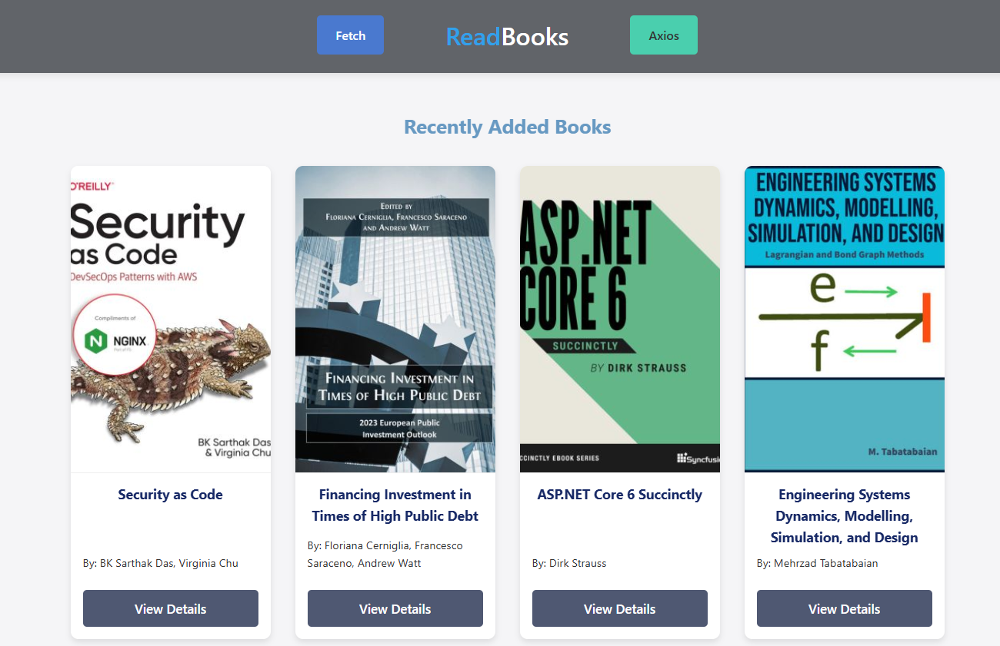

# ReadBooks - Fetch vs Axios

[Live DEMO](https://readbooks-two.vercel.app/)



## Book API
Proyecto demostrativo que compara el uso de **Fetch API** y con **Axios**
- [API: dbook.org](https://www.dbooks.org/api/)

### Fetch API
- Nativo en los navegadores modernos
- Necesita conversión manual de respuestas (`.json()`)
- Manejo básico de errores

### Axios
- Librería externa
- Transformación automática de datos JSON
- Cancelación de peticiones
- Manejo de errores más robusto

#### Instalación 
- **Opción A:** Usando npm 
```bash
npm install axios
```
- Luego importa en tu archivo JS:
```javascript
import axios from 'axios';
```
- **Opción B:** CDN con navegadores (usado en este proyecto)
```html
<script src="https://cdn.jsdelivr.net/npm/axios/dist/axios.min.js"></script>
```


| Archivo        | Tecnología | Descripción                          |
|----------------|------------|--------------------------------------|
| `index.html`   | Fetch      | Muestra libros recientes             |
| `search.html`  | Axios      | Busca libros por título/autor        |
