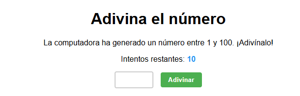

# Juego de Adivinar el Número

Juego simple para adivinar un número, creado con Vite y JavaScript vanilla.

[Live DEMO](https://js-advanced-development.vercel.app/)



## Características

- Genera números aleatorios entre 1 y 100
- Contador de intentos (máximo 10)
- Pistas si el número es mayor o menor
- Botón para reiniciar el juego
- Validación de entrada

## Instalación

1. Clona el repositorio
2. Instala las dependencias:
```bash
npm install
```
3. Iniciar el servidor de desarrollo:
```bash
npm run dev
```

